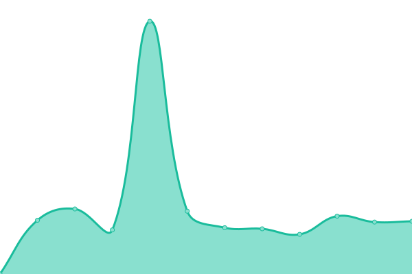
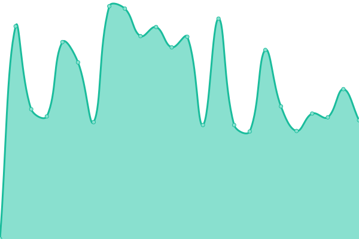

# [📈 Live Status](https://ageg-status.github.io): <!--live status--> **🟩 All systems operational**

This repository contains the open-source uptime monitor and status page for [ageg-status](https://ageg-status.github.io), powered by [Upptime](https://github.com/upptime/upptime).

With [Upptime](https://upptime.js.org), you can get your own unlimited and free uptime monitor and status page, powered entirely by a GitHub repository. We use [Issues](https://github.com/ageg-status/ageg-status.github.io/issues) as incident reports, [Actions](https://github.com/ageg-status/ageg-status.github.io/actions) as uptime monitors, and [Pages](https://ageg-status.github.io) for the status page.

<!--start: status pages-->
<!-- This summary is generated by Upptime (https://github.com/upptime/upptime) -->
<!-- Do not edit this manually, your changes will be overwritten -->
<!-- prettier-ignore -->
| URL | Status | History | Response Time | Uptime |
| --- | ------ | ------- | ------------- | ------ |
|  [AGEG website](https://www.ageg.ca/) | 🟩 Up | [ageg-website.yml](https://github.com/ageg-status/ageg-status.github.io/commits/HEAD/history/ageg-website.yml) | 

 1542ms
     
 | 

<a href="https://ageg-status.github.io/history/ageg-website">100.00%</a>
    

|  [UdeS website](https://www.usherbrooke.ca/) | 🟩 Up | [ude-s-website.yml](https://github.com/ageg-status/ageg-status.github.io/commits/HEAD/history/ude-s-website.yml) | 

 687ms
     
 | 

<a href="https://ageg-status.github.io/history/ude-s-website">100.00%</a>
    

|  [2 Minutes de génie (prod)](https://2mdg.ageg.ca/) | 🟩 Up | [2-minutes-de-genie-prod.yml](https://github.com/ageg-status/ageg-status.github.io/commits/HEAD/history/2-minutes-de-genie-prod.yml) | 

 528ms
     
 | 

<a href="https://ageg-status.github.io/history/2-minutes-de-genie-prod">100.00%</a>
    

|  [2 Minutes de génie (gitlab page)](https://2mdg.gitlab.io/) | 🟩 Up | [2-minutes-de-genie-gitlab-page.yml](https://github.com/ageg-status/ageg-status.github.io/commits/HEAD/history/2-minutes-de-genie-gitlab-page.yml) | 

 404ms
     
 | 

<a href="https://ageg-status.github.io/history/2-minutes-de-genie-gitlab-page">100.00%</a>
    

|  [2 Minutes de génie (staging)](https://2mdgstaging.gitlab.io/) | 🟩 Up | [2-minutes-de-genie-staging.yml](https://github.com/ageg-status/ageg-status.github.io/commits/HEAD/history/2-minutes-de-genie-staging.yml) | 

 497ms
     
 | 

<a href="https://ageg-status.github.io/history/2-minutes-de-genie-staging">100.00%</a>
    

<!--end: status pages-->

[**Visit our status website →**](https://ageg-status.github.io)

## 📄 License

- Powered by: [Upptime](https://github.com/upptime/upptime)
- Code: [MIT](./LICENSE) © [ageg-status](https://ageg-status.github.io)
- Data in the `./history` directory: [Open Database License](https://opendatacommons.org/licenses/odbl/1-0/)
